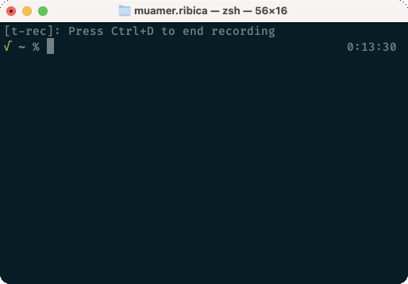

# Bills

Command-line utility expenses tracker supporting providers in Bosnia and Herzegovina.
Since most of these providers are not implementing developer friendly REST API there are different http client implementations ranging from scraping html pages to consuming REST API.



# Build and Run

```
$ go build -o bills cmd/cli/main.go
$ ./bills
```

# Providers

- [Elektroprivreda BiH](https://www.epbih.ba/) electricity provider
- [Toplane](https://www.toplanesarajevo.ba/korisnici/stanje-racuna) heating provider
- [Telemach](https://mojtelemach.ba/) cable TV and Internet provider

# Configuration and Credentials

Bills is expecting to have providers configuration at $HOME/.bills/providers.json. Use [example-providers.json](example/example-providers.json) as a reference for supported providers and required credentials. If you are not using some providers from the example file just remove it from the configuration file and it will not be included in the report.